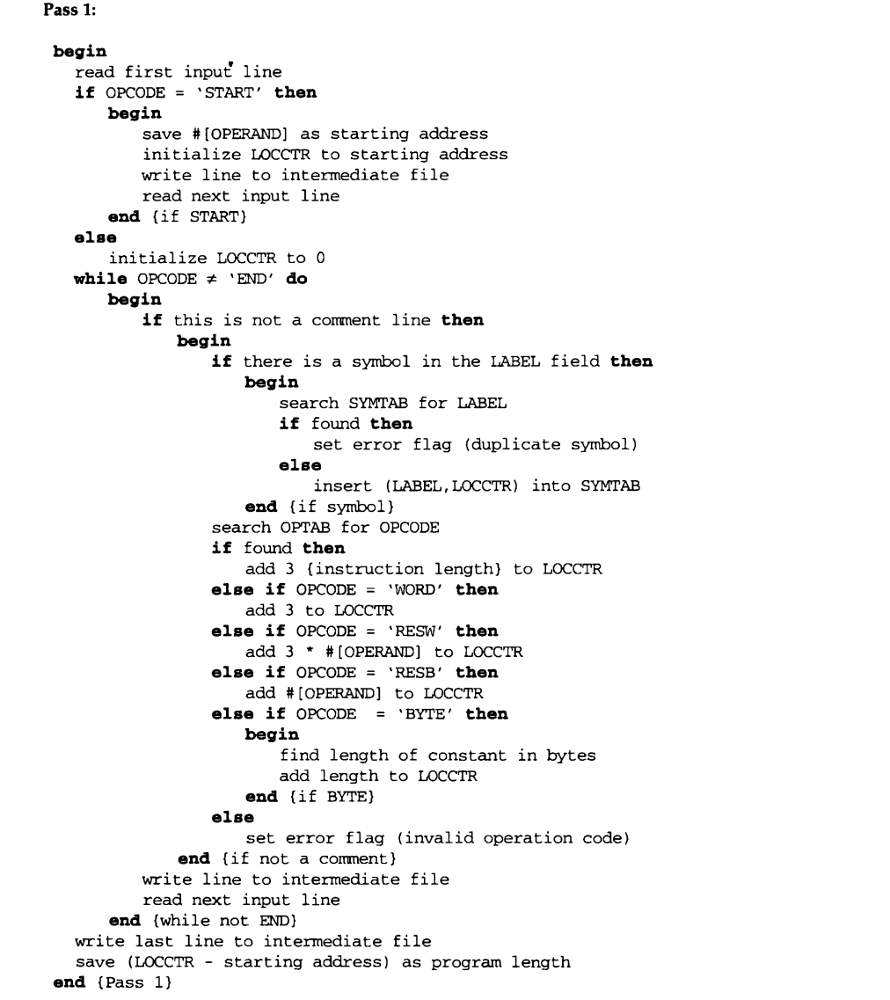
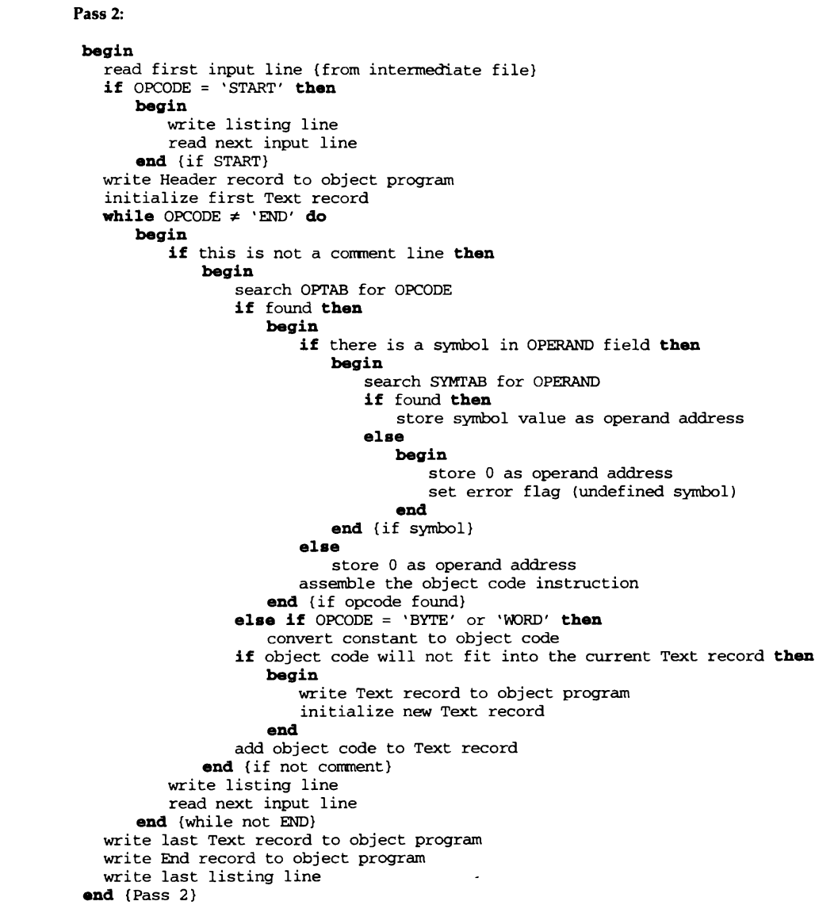

# System-Software---SIC-XE-machine-independent-


###	Introduction
   
The Objective of the project is to implement a version of two-pass SIC/XE assembler: Pass 1 and Pass 2 for all instruction formats with expression independent feature.
The Assembler we implemented includes all the SIC/XE instructions and supports all four formats 1, 2, 3, 4, addressing modes and program relocation.


In SIC-XE  machine-Independent Assembler Features are-
•	Literals
•	Symbol Defining Statements 
•	Expressions
•	Program Blocks
•	Control Sections and Program Linking

A Two-Pass assembler functions as follows-
<br>
<br>

Pass 1
<br>
•	Assign addresses to all statements in the program
<br>

•	Save the values assigned to all labels for use in Pass 2
<br>

•	Perform some processing of assembler directives
<br>
<br>

Pass 2
<br>

•	Assemble instructions
<br>

•	Generate data values defined by BYTE, WORD
<br>

•	Perform processing of assembler directives not done in Pass 1
<br>

•	Write the object program and the assembly listing
<br>


###	Algorithm
Pass1: 
<br>
Pass 2:
 

3.	Sample input and output cases
Input:

```asm
COPY    START	0
	EXTDEF	BUFFER,BUFEND,LENGTH
	EXTREF	RDREC,WRREC
FIRST	STL	RETADR
CLOOP	+JSUB	RDREC
	LDA	LENGTH
	COMP	#0
	JEQ	ENDFIL
	+JSUB	WRREC
	J	CLOOP
ENDFIL	LDA	=C'EOF'
	STA	BUFFER
	LDA	#3
	STA	LENGTH
	+JSUB	WRREC
	J	@RETADR
RETADR	RESW	1
LENGTH	RESW	1
	LTORG
BUFFER	RESB	4096
BUFEND	EQU	*
MAXLEN	EQU	BUFEND-BUFFER
RDREC	CSECT
	EXTREF	BUFFER,LENGTH,BUFFEND
	CLEAR	X
	CLEAR	A
	CLEAR	S
	LDT	MAXLEN
RLOOP	TD	INPUT
	JEQ	RLOOP
	RD	INPUT
	COMPR	A,S
	JEQ	EXIT
	+STCH	BUFFER, X
	TIXR	T
	JLT	RLOOP
EXIT	+STX	LENGTH
	RSUB
INPUT	BYTE	X'F1'
MAXLEN	WORD	BUFEND-BUFFER
WRREC	CSECT
	EXTREF	LENGTH, BUFFER
	CLEAR	X
	+LDT	LENGTH
WLOOP	TD	=X'05'
	JEQ	WLOOP
	+LDCH	BUFFER, X
	WD	=X'05'
	TIXR	T
	JLT	WLOOP
	RSUB
	END	FIRST
```

Intermediate file generated:
```asm
Line	Address	Label	OPCODE	OPERAND	Comment
5	00000	0	COPY	START	0	
10	 	 	 	EXTDEF	BUFFER,BUFEND,LENGTH	
15	 	 	 	EXTREF	RDREC,WRREC	
20	00000	0	FIRST	STL	RETADR	
25	00003	0	CLOOP	+JSUB	RDREC	
30	00007	0		LDA	LENGTH	
35	0000A	0		COMP	#0	
40	0000D	0		JEQ	ENDFIL	
45	00010	0		+JSUB	WRREC	
50	00014	0		J	CLOOP	
55	00017	0	ENDFIL	LDA	=C'EOF'	
60	0001A	0		STA	BUFFER	
65	0001D	0		LDA	#3	
70	00020	0		STA	LENGTH	
75	00023	0		+JSUB	WRREC	
80	00027	0		J	@RETADR	
85	0002A	0	RETADR	RESW	1	
90	0002D	0	LENGTH	RESW	1	
95	00030	0		LTORG	 	
100	00030	0	*	=C'EOF'	 	 
105	00033	0	BUFFER	RESB	4096	
110	01033	0	BUFEND	EQU	*	
115	01000	 	MAXLEN	EQU	BUFEND-BUFFER	
120	00000	0	RDREC	CSECT
125	00000	0	FER,LENGTH,BUFFEND			
130	00000	0		CLEAR	X	
135	00002	0		CLEAR	A	
140	00004	0		CLEAR	S	
145	00006	0		LDT	MAXLEN	
150	00009	0	RLOOP	TD	INPUT	
155	0000C	0		JEQ	RLOOP	
160	0000F	0		RD	INPUT	
165	00012	0		COMPR	A,S	
170	00014	0		JEQ	EXIT	
175	00017	0		+STCH	BUFFER,X	
180	0001B	0		TIXR	T	
185	0001D	0		JLT	RLOOP	
190	00020	0	EXIT	+STX	LENGTH	
195	00024	0		RSUB	 	
200	00027	0	INPUT	BYTE	X'F1'	
205	00028	0	MAXLEN	WORD	BUFEND-BUFFER	
210	00000	0	WRREC	CSECT
215	00000	0	GTH,	BUFFER		
220	00000	0		CLEAR	X	
225	00002	0		+LDT	LENGTH	
230	00006	0	WLOOP	TD	=X'05'	
235	00009	0		JEQ	WLOOP	
240	0000C	0		+LDCH	BUFFER,X	
245	00010	0		WD	=X'05'	
250	00013	0		TIXR	T	
255	00015	0		JLT	WLOOP	
260	00018	0		RSUB	 	
265	0001B	 		END	FIRST	
270	0001B	0	*	=X'05'	 	
```
Symbol table generated:

```asm
**********************************SYMBOL TABLE*****************************

:-	name:undefined	|address:0	|relative:00000 

:-	name:undefined	|address:0	|relative:00000 
0:-	name:	|address:0	|relative:00000 
BUFEND:-	name:BUFEND	|address:00000	|relative:00000 
BUFFER:-	name:BUFFER	|address:00030	|relative:00001 
BUFFER:-	name:undefined	|address:0	|relative:00000 
CLOOP:-	name:CLOOP	|address:00003	|relative:00001 
ENDFIL:-	name:ENDFIL	|address:00017	|relative:00001 
EXIT:-	name:EXIT	|address:01050	|relative:00001 
FIRST:-	name:FIRST	|address:00000	|relative:00001 
INPUT:-	name:INPUT	|address:01054	|relative:00001 
LENGTH:-	name:LENGTH	|address:0002D	|relative:00001 
MAXLEN:-	name:MAXLEN	|address:00000	|relative:00000 
RDREC:-	name:RDREC	|address:01030	|relative:00001 
RETADR:-	name:RETADR	|address:0002A	|relative:00001 
RLOOP:-	name:RLOOP	|address:01039	|relative:00001 
WLOOP:-	name:WLOOP	|address:0105E	|relative:00001 
WRREC:-	name:WRREC	|address:01058	|relative:00001 
```
 

Literal table generated:

```asm
**********************************LITERAL TABLE*****************************

C'EOF':-value:C'EOF'|address:01070 
X'05':-	value:X'05'|address:01074 

```


EXTREF table generated:

```asm
**********************************EXTREF TABLE*****************************

BUFFEND:-name:BUFFEND|DEFAULT 
BUFFER:-name:BUFFER	|DEFAULT 
LENGTH:-name:LENGTH	|DEFAULT 
RDREC:-	name:RDREC	|DEFAULT 
WRREC:-	name:WRREC      |DEFAULT 

```


EXTDEF table generated:

```asm

**********************************EXTDEF TABLE*****************************


BUFEND:-	name:BUFEND |address:01030	| 
BUFFER:-	name:BUFFER |address:00030	| 
LENGTH:-	name:LENGTH |address:00030	|

```


 
 

